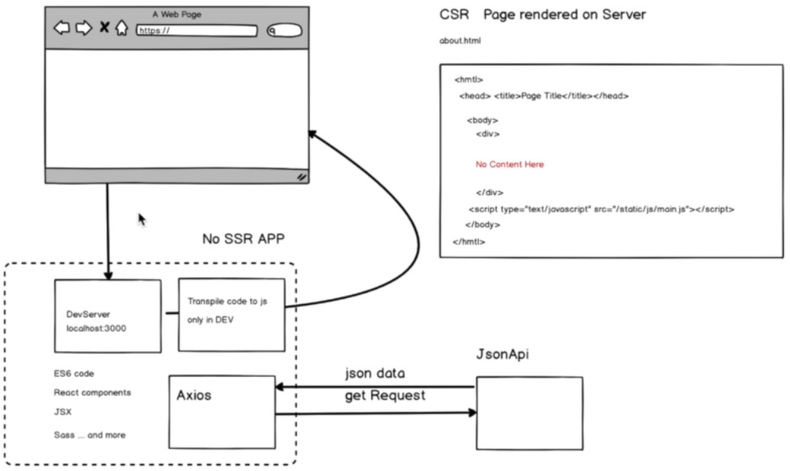
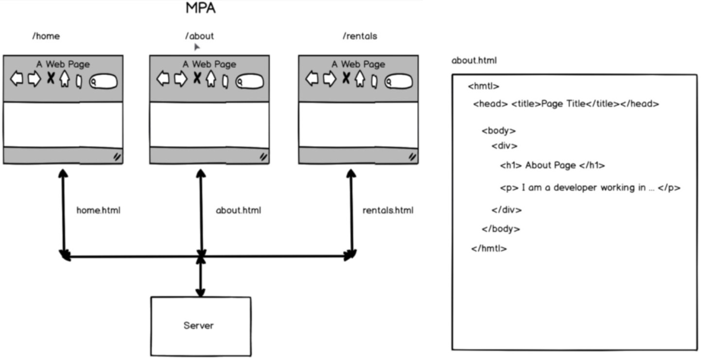
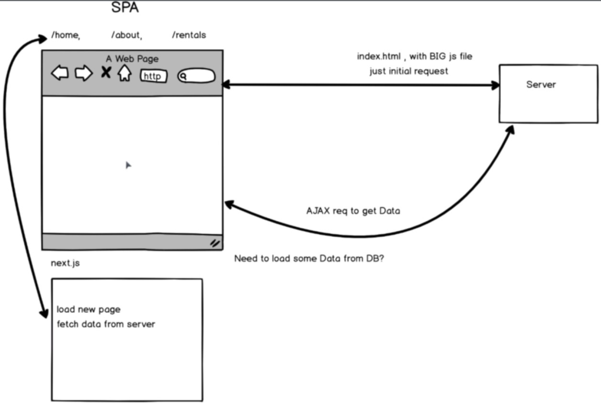
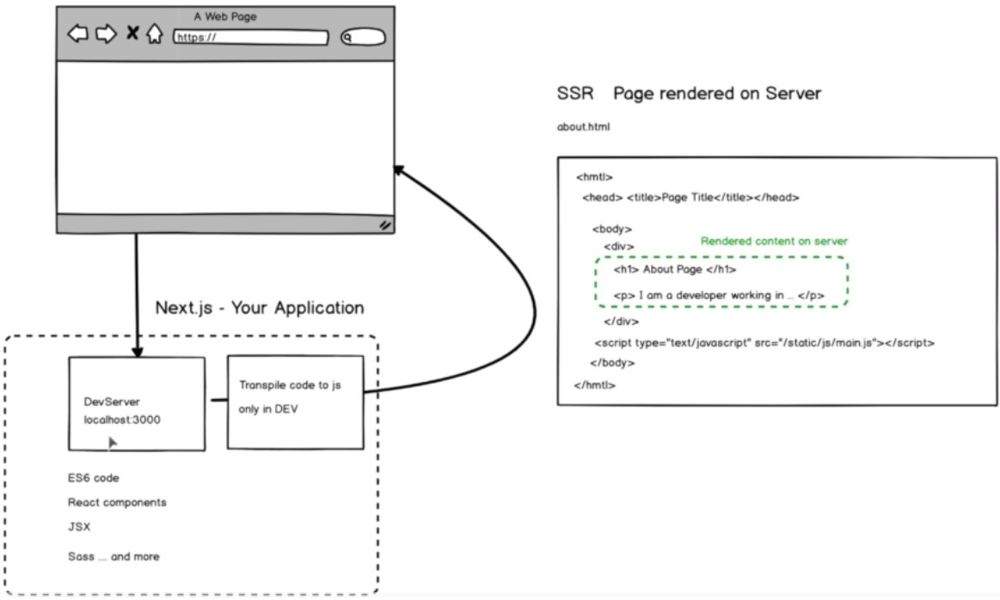
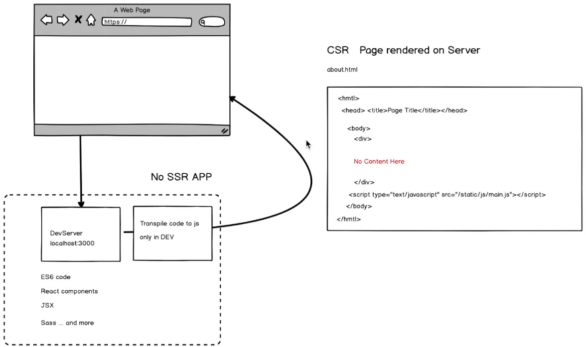

# next-js-fundamentals

- [next.js docs](https://nextjs.org/docs)
- [next.js getting started](https://nextjs.org/learn/basics/getting-started)
- [next.js examples](https://github.com/zeit/next.js/tree/canary/examples)
- [next.js github repository](https://github.com/zeit/next.js)
- [deploy ZEIT Now](https://zeit.co/docs/v2/introduction)

## Demo

- [ZEIT Now](https://next-js-fundamental.now.sh)

## Basic setup

```
npm i -y
npm install --save react react-dom next
mkdir pages
```

replace scripts in package.json<br>

```
"scripts": {
  "dev": "next",
  "build": "next build",
  "start": "next start"
}
```

## React components

- `Functional Component` or Dumb components, it can get data and return data

```js
const Index = () => {
  return <h1>I am Index Page</h1>;
};
```

or we can write it like function classical syntax

```js
const Index = function() {
  return <h1>I am Index Page from Normal Function</h1>;
};
```

- `Class Component` it has more functionality, more stuff and user Lifecycle function

```js
class Index extends React.Component {
  render() {
    return <h1>I am Index Page from Class Component</h1>;
  }
}
```

## Get initial props</br>

</br>
The behavior of an object depends on the variables and the methods of that class. When we create a class we create an object for it. For static methods, we don't require them as static methods means all the objects will have the same copy so there is no need of an object.</br>

In instance method each object will have different behaviour so they have to call the method using the object instance<br>

```js
class Human {
  talk() {
    console.log('I am talking');
  }

  static walk() {
    console.log('I am walking');
  }
}

// call instance method
const human = new Human();
human.talk();

// call static method
Human.walk();
```

## New pages

you have to create in the pages folder every new pages

## Single page application (SPA) and multi page application (MPA)

[info SPA vs MPA](https://medium.com/@NeotericEU/single-page-application-vs-multiple-page-application-2591588efe58)</br>

### <center>`MPA`</center>

</br>

### <center>`SPA`</center>

</br>

## Shared components - Header

[./components/shared/Header.js](./components/shared/Header.js)<br>

## Base layout

[./components/layouts/BaseLayout.js](./components/layouts/BaseLayout.js)<br>
[./pages/cv.js](./pages/cv.js)<br>
[./pages/blogs.js](./pages/blogs.js)<br>
[./pages/about.js](./pages/about.js)<br>

## Types of styling

[next.js + sass config](https://github.com/zeit/next-plugins/tree/master/packages/next-sass)<br>

## Fetching Data for Pages example use [JSONPlaceholder](https://jsonplaceholder.typicode.com)

[./pages/index.js](./pages/index.js)<br>

## React lifecycle functions

[./pages/index.js](./pages/index.js)<br>

## Dynamic route vs static route

Dynamic routing is also known as adaptive routing which change routing table according to the change in topology. Dynamic routing uses complex routing algorithms and it does not provide high security like static routing. When the network change(topology) occurs, it sends the message to router to ensure that changes then the routes are recalculated for sending updated routing information.<br>

Static Routing is also known as non-adaptive routing which doesn’t change routing table unless the network administrator changes or modify them manually. Static routing does not use complex routing algorithms and It provides high or more security than dynamic routing.<br>

## Basic server setup

[./server/ssr.js](./server/ssr.js)<br>
[./server/ssr-catching.js](./server/catching.js)<br>

## Server side rendering vs Client side rendering</br>

- [very good google extension: View Rendered Source](https://chrome.google.com/webstore/detail/view-rendered-source/ejgngohbdedoabanmclafpkoogegdpob)<br>

View source is dead. See how the browser renders a page, not just what the server sends.
A lightweight Chrome Extension that shows you how the browser has constructed (rendered) a page's original HTML into a functioning DOM, including modifications made by JavaScript.<br>

An essential tool for web developers using JavaScript frameworks like Angular, ReactJS and Vue.js, and for SEOs to understand how search engines see your pages, especially considering Google's dynamic serving workaround.<br>

Differences between raw and rendered versions are highlighted line-by-line showing how JavaScript has modified a page at render time.<br>

### <center>`SSR`</center>

<br>

### <center>`CSR`</center>

<br>

### <center>`benefits`</center>

- [SSR vs CSR](https://nextjs.org/features/server-side-rendering#benefits)<br>

### <center>`interesting links`</center>

- [SSR vs CSR](https://blog.logrocket.com/next-js-vs-create-react-app)<br>
- [SSR vs CSR](https://codeburst.io/next-js-ssr-vs-create-react-app-csr-7452f71599f6)<br>
